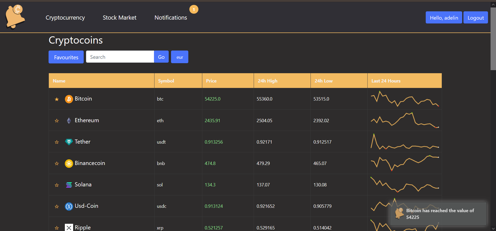

# NotifyMe

NotifyMe is a cryptocurrency and stock market tracking web application built using the Django web framework. The application features a notification system that allows users to personalize their experience and receive alerts about changes in cryptocurrency prices, either through the web platform or via email. Additionally, NotifyMe includes a REST API that communicates with a mobile app.

[](https://skillicons.dev)

## Table of Contents

- [Demo](#demo)
- [Features](#features)
- [Technologies Used](#technologies-used)
- [Installation](#installation)
- [Usage](#usage)
- [Contributing](#contributing)
- [License](#license)
- [Contact](#contact)

## Demo



## Main Features

### 1. Cryptocurrency Tracking
- Tracks and displays information about various cryptocurrencies by using CoinGeckoAPI

### 2. User Authentication and Registration
- Allows users to create accounts and log in to access the application's features. Includes email verification.

### 3. Favorite Cryptocurrencies
- Enables users to add and remove favorite cryptocurrencies.

### 4. Currency Conversion
- Users can select their preffered currency (EURO, USD, RUB, GBP).

### 5. Notification System
- Users can create notifications based on their preffered cryptocoins, being notified when a coin changes its value or when it reaches a certain value.

### 6. Search and Filtering
- Allows users to search for specific cryptocurrencies.

### 7. Data Visualization
- Displays cryptocurrency price charts and other related data. Utilizes data visualization libraries like Sparkline to offer interactive and informative charts.

### 8. API Integration
- Integrates with external APIs to ensure accurate and up-to-date cryptocurrency data and stockmarket data using CoinGecko and finnhub.

## Technologies Used

- **Backend**:
  - [Django](https://www.djangoproject.com/): High-level Python web framework that encourages rapid development and clean, pragmatic design.
  - [SQLite](https://www.sqlite.org/): Lightweight, disk-based database used for development.

- **Frontend**:
  - [HTML5](https://developer.mozilla.org/en-US/docs/Web/Guide/HTML/HTML5): Markup language for structuring and presenting content.
  - [CSS3](https://developer.mozilla.org/en-US/docs/Web/CSS): Style sheet language used for describing the presentation of a document.
  - [Bootstrap](https://getbootstrap.com/): Frontend framework for developing responsive and mobile-first websites.
  - [JavaScript](https://developer.mozilla.org/en-US/docs/Web/JavaScript): Programming language that enables interactive web pages.

- **Tools and Libraries**:
  - [Git](https://git-scm.com/): Version control system for tracking changes in source code.
  - [Virtualenv](https://virtualenv.pypa.io/): Tool to create isolated Python environments.
  - [pip](https://pip.pypa.io/): Package installer for Python.

## Installation

1. **Clone the repository:**

    ```bash
    git clone https://github.com/AdelinCraciunesc/NotifyMe
    cd quiz-app
    ```

2. **Create and activate a virtual environment:**

    ```bash
    python -m venv venv
    source venv/bin/activate  # On Windows use `venv\Scripts\activate`
    ```

3. **Install the required dependencies:**

    ```bash
    pip install -r requirements.txt
    ```

4. **Run migrations:**

    ```bash
    python manage.py migrate
    ```

5. **Create a superuser:**

    ```bash
    python manage.py createsuperuser
    ```

6. **Run the development server:**

    ```bash
    python manage.py runserver
    ```

    The app will be available at `http://127.0.0.1:8000/`.

## Usage

1. **Register an account to access all features.**
2. **Track cryptocurrencies and add your favorites.**
3. **Set up notifications to stay updated on price changes.**
4. **Explore charts and data visualizations for in-depth analysis.**

## Contributing

Contributions are welcome! Please follow these steps:

1. Fork the repository.
2. Create a new branch (`git checkout -b feature-branch`).
3. Make your changes.
4. Commit your changes (`git commit -m 'Add some feature'`).
5. Push to the branch (`git push origin feature-branch`).
6. Open a pull request.

## License

This project is licensed under the MIT License - see the [LICENSE](LICENSE) file for details.

## Contact

If you have any questions or suggestions, feel free to contact me:

- **Email**: adelin.craciunesc21@gmail.com
- **GitHub**: [AdelinCraciunesc](https://github.com/AdelinCraciunesc)
- **LinkedIn**: [Adelin Crăciunesc](https://www.linkedin.com/in/lascu-adelin-cr%C4%83ciunesc-a46a26212/)
